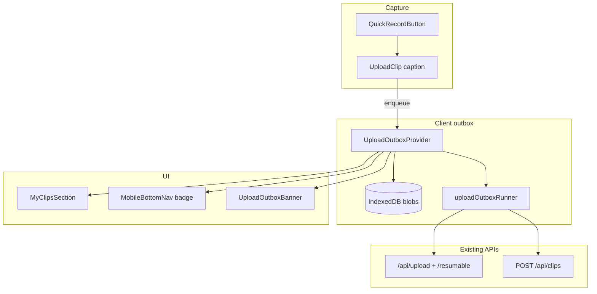
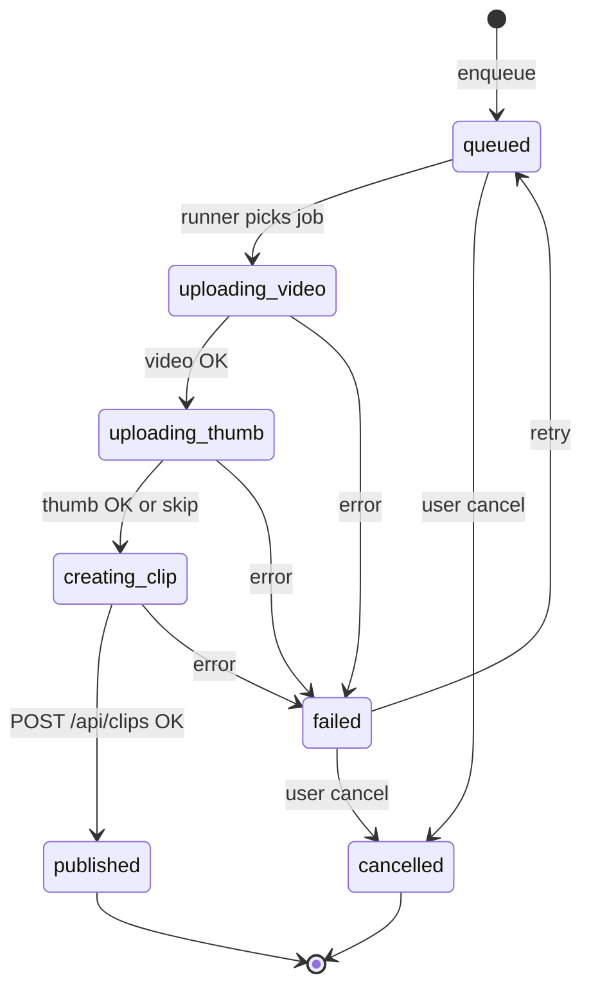

# Upload outbox — build sketch

Background clip uploads for slow networks and back-to-back recording at shows. Client-only pending state until `POST /api/clips` succeeds.

## Goals

| Goal | Success criterion |
|------|-------------------|
| Non-blocking post | Tap **Share** → leave caption screen within ~300ms |
| Visible progress | Pending tile shows local preview + real % (XHR / chunks) |
| Record while uploading | Open camera again with ≤1 active upload, queue depth cap |
| Survive navigation | Blobs + metadata in IndexedDB until published or user cancels |
| Retry | Failed jobs show **Retry** without re-entering caption |

**Non-goals (v1):** Service Worker uploads, server `status: pending` clips in feed, upload after tab killed.

---

## Architecture



### Job lifecycle



---

## New files

```
src/react-app/
  contexts/
    UploadOutboxContext.tsx      # Provider + useUploadOutbox()
  lib/
    upload-outbox/
      types.ts                   # UploadOutboxJob, states, payload types
      idb.ts                     # persist blob + meta; revoke object URLs
      buildClipPayload.ts        # mirror UploadClip handleSubmit clipData
      runner.ts                  # single-flight processor (no React)
      enqueueFromCaption.ts      # map form state → job
  components/
    PendingClipTile.tsx          # grid tile: preview + ring progress + retry
    UploadOutboxBanner.tsx       # slim bar when jobs active (optional v1)
  hooks/
    useUploadOutboxSummary.ts    # { active, failed, total } for nav badge
```

**Reuse (no moves):** `useResumableUpload.ts`, `generateVideoThumbnailJpeg`, `buildHashtagsArrayForPost`, existing upload + clips endpoints.

---

## Core types (`types.ts`)

```ts
export type OutboxJobStatus =
  | 'queued'
  | 'uploading_video'
  | 'uploading_thumb'
  | 'creating_clip'
  | 'published'
  | 'failed'
  | 'cancelled';

export type UploadOutboxJob = {
  id: string; // crypto.randomUUID()
  createdAt: string; // ISO
  status: OutboxJobStatus;
  /** 0–100 for current phase; runner updates */
  progress: number;
  phase: 'video' | 'thumbnail' | 'create' | null;
  error: string | null;
  retryCount: number;

  /** Local preview only */
  previewObjectUrl: string | null;

  /** Caption + metadata (JSON-serializable) */
  payload: ClipOutboxPayload;
};

export type ClipOutboxPayload = {
  artist_name: string | null;
  venue_name: string | null;
  location: string | null;
  content_description: string | null;
  hashtags: string; // raw form field; buildHashtagsArrayForPost at create time
  song_title: string | null;
  genre_name: string | null;
  timestamp?: string;
  jambase_event_id?: string;
  jambase_artist_id?: string;
  jambase_venue_id?: string;
  geolocation_latitude?: number;
  geolocation_longitude?: number;
  recording_orientation?: string | null;
  video_resolution_w?: number | null;
  video_resolution_h?: number | null;
  /** Set after uploads */
  video_url?: string;
  thumbnail_url?: string;
  stream_video_id?: string;
  stream_playback_url?: string;
  stream_thumbnail_url?: string;
  video_status?: string;
  video_duration?: number;
};
```

IndexedDB stores `{ jobId, blob: Blob, thumbBlob?: Blob }` keyed by `id`. Meta list lives in `localStorage` key `upload_outbox_v1` (job rows without blobs) or one IDB object store for everything.

---

## Context API (`UploadOutboxContext.tsx`)

```ts
type UploadOutboxContextValue = {
  jobs: UploadOutboxJob[];
  enqueue: (input: EnqueueInput) => Promise<string>; // returns job id
  retry: (id: string) => void;
  cancel: (id: string) => void;
  /** Active + queued (not published/cancelled) */
  pendingCount: number;
  hasFailed: boolean;
};

type EnqueueInput = {
  videoBlob: Blob;
  thumbnailBlob?: Blob | null;
  payload: ClipOutboxPayload;
  previewObjectUrl?: string;
};
```

**Provider responsibilities:**

1. Hydrate from IDB on mount; recreate `previewObjectUrl` from blob.
2. Expose `jobs` sorted `createdAt` desc.
3. On `enqueue`, write IDB + append meta, kick `runner.processNext()`.
4. Subscribe runner events → `setJobs` + persist.
5. On `published`, remove blob from IDB, revoke preview URL, emit `onPublished(jobId, clip)` optional callback for cache refresh.

**Mount in `App.tsx`:**

```tsx
<AuthProvider>
  <UploadOutboxProvider>
    <MobileChromeProvider>
      <Router>...</Router>
    </MobileChromeProvider>
  </UploadOutboxProvider>
</AuthProvider>
```

Inside provider: only start runner when `user` is logged in; pause when logged out.

---

## Runner (`runner.ts`)

Single module, **one active job** at a time (configurable `MAX_CONCURRENT = 1`).

```ts
// Pseudocode
async function processJob(job: UploadOutboxJob, blobs: StoredBlobs) {
  update(job.id, { status: 'uploading_video', phase: 'video' });

  const file = new File([blobs.video], `recording-${job.id}.webm`, { type: blobs.video.type });
  let thumb = blobs.thumb;
  if (!thumb) {
    thumb = await generateVideoThumbnailJpeg(file);
  }

  const videoData = await resumableUpload(file, (p) =>
    update(job.id, { progress: p.percentage, phase: 'video' })
  );

  update(job.id, { status: 'uploading_thumb', phase: 'thumbnail', progress: 0 });
  let thumbnailUrl: string | null = null;
  if (thumb) {
    const thumbData = await uploadThumbnail(thumb, onThumbProgress);
    thumbnailUrl = thumbData.url;
  }

  const clipData = buildClipPayload(job.payload, videoData, thumbnailUrl);

  update(job.id, { status: 'creating_clip', phase: 'create', progress: 100 });
  const res = await fetch('/api/clips', { method: 'POST', body: JSON.stringify(clipData) });
  if (!res.ok) throw new Error(...);

  update(job.id, { status: 'published' });
  await idbDelete(job.id);
}
```

**Extract** `buildClipPayload` from `UploadClip.tsx` `handleSubmit` (lines ~877–912) so runner and page share one mapping.

**Wire** `useResumableUpload` inside runner via a thin wrapper that accepts `onProgress` callback (lift upload logic from hook into `uploadOutboxUpload.ts` if hook state is awkward outside React).

**Retry policy:** exponential backoff 2s, 8s, 30s; max 5 attempts then stay `failed`.

**Cancel:** abort in-flight XHR via `AbortController` registry per job id; delete IDB row.

---

## UI integration

### 1. `UploadClip.tsx` — enqueue on Share

Replace blocking `handleSubmit` success path:

```ts
const { enqueue } = useUploadOutbox();

const handleSubmit = async () => {
  // validation unchanged
  const blob = formData.video_blob ?? formData.video_file;
  if (!blob) return;

  await enqueue({
    videoBlob: blob instanceof File ? blob : blob,
    thumbnailBlob: formData.thumbnail_file,
    previewObjectUrl: videoBlobUrl,
    payload: { /* fields from formData + captureGeo + jambaseLink + videoMetadata */ },
  });

  // cleanup local blob URL
  navigate('/', { replace: true });
};
```

- Remove `setLoading(true)` blocking UX for happy path (optional short “Added to queue” toast).
- Keep **synchronous** path behind feature flag `VITE_UPLOAD_OUTBOX=1` during rollout.

### 2. `MyClipsSection.tsx` — pending tiles

```tsx
const { jobs } = useUploadOutbox();
const pending = jobs.filter((j) => j.status !== 'published' && j.status !== 'cancelled');

<DashboardClipsGrid
  leadingTiles={pending.map((j) => (
    <PendingClipTile key={j.id} job={j} onRetry={retry} onCancel={cancel} />
  ))}
  clips={clips}
  ...
/>
```

**Extend** `DashboardClipsGrid` with optional `leadingTiles?: ReactNode[]` rendered before API clips in the same grid (or a dedicated row “Uploading…”).

`PendingClipTile`:

- Background: `previewObjectUrl` or generated thumb
- Overlay: semi-transparent + `Loader2` or SVG ring using `job.progress`
- Label: `Uploading… 42%` / `Posting…` / `Failed — tap to retry`
- No delete-to-server until published (cancel = discard local only)

On `published`, call `refresh()` on `useClips` so real clip appears; pending tile disappears.

### 3. `MobileBottomNav.tsx` — badge + record gate

```tsx
const { pendingCount, activeUploading } = useUploadOutboxSummary();

// Dot on Capture tab when pendingCount > 0
// Optional: allow showQuickCapture even when activeUploading (v1.1)
// v1: allow if pendingCount < MAX_QUEUE (3)
```

Do **not** block `QuickRecordButton` on `loading` from UploadClip (already navigates away).

### 4. `UploadOutboxBanner.tsx` (optional)

Fixed above bottom nav: “2 clips uploading — keep this tab open”.

---

## AudD decoupling (PR 2 — parallel to outbox)

Today `handleRecordingComplete` awaits AudD before `navigate('/upload')`.

**Change:**

```ts
// Fire-and-forget or Promise.race with 3s cap
const auddPromise = identifyMusicWithAudD(auddInput);
navigate('/upload', { state: { videoBlob, auddPrefill: { status: 'loading', sourceKey } } });
const auddPrefill = toAudDNavPrefill(sourceKey, await auddPromise);
// UploadClip: useEffect applies auddPrefill when status flips from loading → done
```

Caption screen opens immediately; song fields fill in when AudD returns.

---

## Concurrency & memory

| Constant | Value | Rationale |
|----------|-------|-----------|
| `MAX_QUEUE` | 3 | ~3×30s webm ≈ manageable on mid phones |
| `MAX_CONCURRENT_UPLOADS` | 1 | Venue Wi‑Fi + Stream API |
| Blob persist | On enqueue | Survive refresh before upload starts |

Warn in banner if `pendingCount >= 2`.

---

## Phased PR plan

### PR 1 — Outbox core (no UI grid yet)

- [ ] `types.ts`, `idb.ts`, `runner.ts`, `buildClipPayload.ts`
- [ ] `UploadOutboxContext` + mount in `App.tsx`
- [ ] `useResumableUpload` wired in runner
- [ ] Feature flag; manual test via dev console `enqueue`

### PR 2 — Share enqueues + banner

- [ ] `UploadClip` `handleSubmit` → `enqueue` + navigate home
- [ ] `UploadOutboxBanner` + nav badge
- [ ] Toast on enqueue / on failure

### PR 3 — My clips placeholders

- [ ] `PendingClipTile` + `DashboardClipsGrid.leadingTiles`
- [ ] `MyClipsSection` merge pending + refresh on publish

### PR 4 — Record while uploading

- [ ] Remove any implicit “one upload at a time” guards
- [ ] AudD non-blocking in `QuickRecordButton`
- [ ] Queue cap enforcement + copy

### PR 5 — Polish

- [ ] Retry/backoff tuning
- [ ] Analytics events: `outbox_enqueue`, `outbox_publish`, `outbox_fail`
- [ ] E2E: slow 3G throttle, two clips back-to-back

---

## Testing checklist

1. Slow 3G (DevTools): Share → home in &lt;1s; progress advances on My clips.
2. Refresh mid-upload: job resumes from IDB (same % or restart chunk — acceptable v1: restart upload).
3. Fail network at 50%: status `failed`, Retry completes.
4. Cancel pending: tile gone, IDB clean.
5. Publish success: tile gone, clip in API list after refresh.
6. Second recording while first uploads: camera opens; queue shows 2 jobs.
7. Logout with pending: jobs paused or cleared (product decision: **clear with confirm**).

---

## Risks & mitigations

| Risk | Mitigation |
|------|------------|
| iOS kills tab | Copy: keep app open; SW later |
| IDB quota | Max queue 3; compress not needed for &lt;1min clips |
| Duplicate posts on retry | Idempotency key header on `POST /api/clips` (future server) |
| Fake progress today | Runner uses real XHR/chunk % only |

---

## Open product decisions

1. **Feed visibility:** Pending only on My clips, or also a private “Uploading” strip on home?
2. **Logout:** Drop queue vs warn?
3. **Feature flag default:** off in prod until PR 3 verified?

---

## Reference: current upload choke points

- `UploadClip.handleSubmit` — blocking upload + `navigate('/')` only after full pipeline
- `useResumableUpload` — implemented, unused
- `QuickRecordButton.handleRecordingComplete` — AudD blocks before `/upload`
